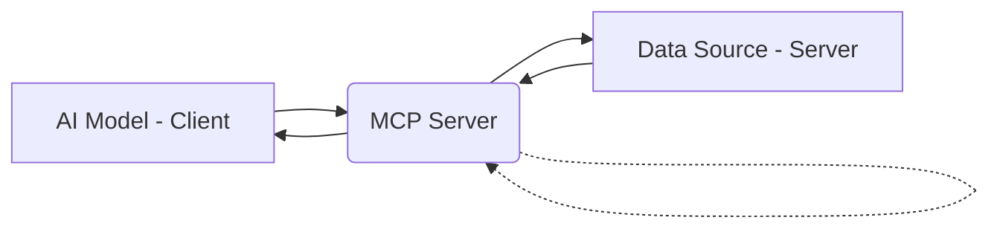
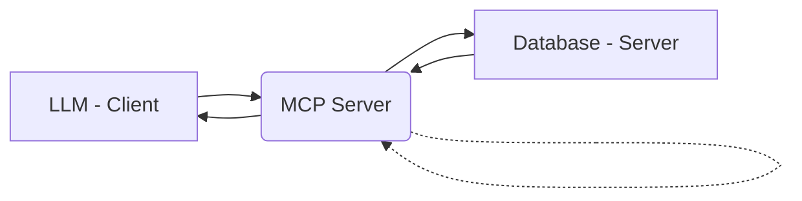
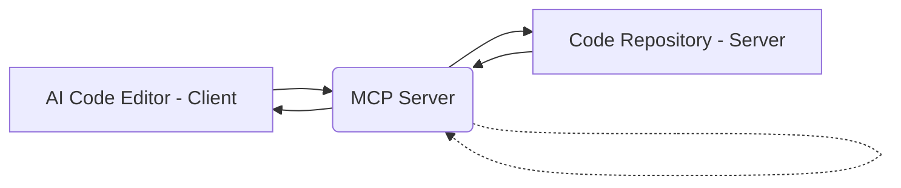

[]()


# Unlocking AI's Potential: A Deep Dive into the Model Context Protocol (MCP)

Hey everyone! Akshit here, and today, we’re diving deep into the Model Context Protocol (MCP)! But instead of just throwing a wall of text at you, let's have a conversation. Ready? Let’s go! 🚀

---

**You:** Akshit, what exactly is the Model Context Protocol (MCP)? Sounds fancy!

**Akshit:** Imagine you’re trying to get an AI to order pizza. The AI needs to talk to the restaurant's website, but every website has a different format. Without a standard way to communicate, it's a mess. MCP solves this by acting as a universal translator for AI models, allowing them to interact seamlessly with databases, APIs, and external tools. It makes AI applications more powerful and efficient!

**You:** So, it’s like a common language for AI and external systems?

**Akshit:** Exactly! MCP standardizes how AI models (like LLMs) fetch data, execute commands, and interact with different systems. This makes it easier to build AI-powered applications like smart IDEs, chatbots, and automation tools. Think of MCP as the glue that connects AI to the real world. 

## 🔑 Key Features of MCP

**You:** Cool! What makes MCP so special?

**Akshit:** MCP comes packed with features that make AI integration seamless:

🖥️ **Client-Server Architecture** – The AI model (client) sends requests to an MCP server, which talks to external data sources (server). Imagine using a food delivery app: your phone is the client, the app is MCP, and the restaurant is the server.



📡 **JSON-RPC 2.0 Communication** – MCP uses JSON-RPC 2.0, a lightweight and efficient messaging protocol. Here’s how a typical request works:

```json
{
  "jsonrpc": "2.0",
  "method": "getDatabaseData",
  "params": {
    "query": "SELECT * FROM users WHERE id = 1"
  },
  "id": 1
}
```

🎭 **Flexible Data Handling** – Supports structured data (JSON, CSV), unstructured data (text, images), and binary data.

🔒 **Security First** – Features authentication, authorization, and encryption to protect data. Implementations can use OAuth 2.0, JWT, or TLS encryption.

🛠️ **Extensibility** – Developers can add new AI models and data sources by creating custom handlers that follow the MCP specification.

## 🚀 Why Should You Care About MCP?

**You:** Okay, but why should I use MCP instead of just making custom APIs?

**Akshit:** Great question! MCP offers some serious advantages:

✔️ **Standardization** – Works across different AI models and data sources, eliminating compatibility issues.
✔️ **Flexibility** – Supports various AI models and data types.
✔️ **Security** – Built-in authentication and encryption keep data safe.
✔️ **Efficiency** – Saves development time by providing a standardized integration framework.
✔️ **Scalability** – Handles large-scale AI applications effortlessly.

## 🎬 MCP in Action: Real-World Use Cases

**You:** Sounds awesome! Can you give some real-world examples?

**Akshit:** Of course! Here are two practical scenarios where MCP shines:

📊 **Example 1: LLM & Databases** – An AI model (like ChatGPT) needs to query a database. Instead of manually creating an API for every query, the AI sends an MCP request. The server runs the query and returns the data.



💻 **Example 2: AI-powered Code Editor & GitHub** – An AI-powered IDE uses MCP to fetch, edit, and commit code to a GitHub repository.



## 🔄 Comparing MCP with Other Solutions

| Feature          | MCP                               | LangChain                           | Custom APIs                          |
|-----------------|------------------------------------|--------------------------------------|--------------------------------------|
| Standardization  | High                               | Medium                               | Low                                   |
| Flexibility      | High                               | High                                 | Medium                               |
| Security         | Robust built-in mechanisms         | Depends on implementation              | Depends on implementation              |
| Ease of Use      | Requires understanding JSON-RPC 2.0 | Relatively easier to learn and use   | Can be complex depending on design    |
| Scalability      | Designed for scalability            | Can be scaled with proper design      | Depends on implementation              |

## 🎯 Wrapping Up: Why MCP is a Game-Changer

**You:** So, should developers start using MCP for AI applications?

**Akshit:** Absolutely! MCP is transforming AI development by standardizing communication, improving security, and making integrations seamless. If you're working on AI applications that need external data access, MCP is the way to go!

| 🌟 **Key Takeaways** |
|-----------------------|
| Standardization       |
| Flexibility           |
| Security              |
| Efficiency            |
| Scalability           |

## 📚 Want to Learn More?

Check out these resources:

*   Microsoft blog post on MCP integration with Azure OpenAI services: [Insert Link Here]
*   MCP GitHub repository: [Insert Link Here]
*   Anthropic API documentation mentioning MCP: [Insert Link Here]
*   Beginner's guide to MCP (Medium article): [Insert Link Here]
*   Official MCP specification document: https://spec.modelcontextprotocol.io/specification/

Let me know if you have any questions! Happy coding! 😄

